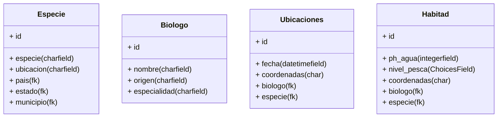

# HackTheOcean :turtle:

## Preservacion de especies maritimas en peligro de extincion

## Metas

- Detectar avistamientos.
- Detencion de especies
- Captura de Ubicacion
- Captura de calidad de habitad

## Front End

- Landing page.
- Imagenes de especies en peligro de extincion.
- Informacion sobre la pezca.
- Causa de muerte
- Soluciones
- Publicidad
- Donaciones
- Organizaciones que apoyan a la causa
- Mapa especies
- Mockups

## Backend

- CRUD.
- Base de datos.
- API's.
- Pruebas de unidad.
- Dependencias.
- Tecnologias(NodeJS).

## Herramientas

- Base de datos: PostgresSql

# Tablas

## Actualizaciones

- Idioma ingles
- Otras Especies no marinas
